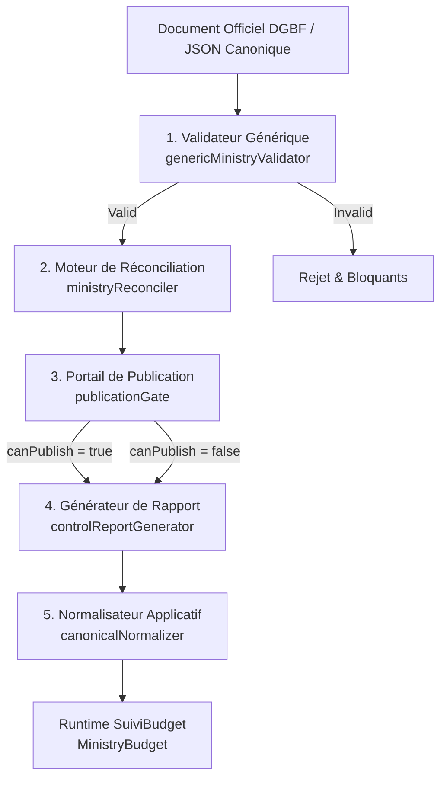

# Pipeline Industriel d'Ingestion Budgétaire Ministérielle (LOT 3)
## SuiviBudget Côte d'Ivoire — Infrastructure Civique & Données Officielles

---

## 1. Contexte & Objectif

Dans le cadre du **LOT 2**, l'architecture pilote pour le Ministère des Mines, du Pétrole et de l'Énergie (**MMPE**, code DGBF `348`, institution `gov-008`) a été établie et validée avec succès :
- **10 programmes budgétaires officiels DGBF**
- **21 actions budgétaires**
- **18 projets d'investissements rattachés**
- **Équilibre arithmétique parfait** :
  $$\text{Ministère} = 706\,060\,209\,015\text{ FCFA}$$
  $$\sum \text{Programmes} = 706\,060\,209\,015\text{ FCFA}\quad (\Delta = 0)$$
  $$\sum \text{Actions} = 706\,060\,209\,015\text{ FCFA}\quad (\Delta = 0)$$
  $$\sum \text{Projets} = 304\,158\,991\,377\text{ FCFA}\quad (\text{intégrés aux actions})$$

Le **LOT 3** a pour mandat d'**industrialiser** ce processus. Plutôt que de coder manuellement les 34 autres ministères de l'État de Côte d'Ivoire, le LOT 3 fournit un **moteur générique, strict et déterministe** garantissant :
1. Zéro inférence arbitraire ou devinette.
2. Zéro cast risqué (`0 any`).
3. Zéro confusion entre `UNKNOWN`, `0` et fallback.
4. Zéro réconciliation artificielle : un écart officiel reste un `SOURCE_GAP`.
5. Protection stricte de l'espace citoyen via un **Portail de Publication (Publication Gate)** bloquant toute donnée incomplète ou déséquilibrée.

---

## 2. Architecture du Pipeline

Le pipeline s'articule autour de 5 modules découplés, purs et testés :



### Modules et Emplacements :
- `src/budget-ingestion/types/index.ts` : Contrat d'interface TypeScript canonique strict.
- `src/budget-ingestion/validators/genericMinistryValidator.ts` : Contrôle syntaxique, structurel et de provenance documentaire.
- `src/budget-ingestion/reconcilers/ministryReconciler.ts` : Réconciliation arithmétique multi-niveaux.
- `src/budget-ingestion/gates/publicationGate.ts` : Décision binaire déterministe de publication.
- `src/budget-ingestion/reports/controlReportGenerator.ts` : Génération d'un audit machine-readable.
- `src/budget-ingestion/normalizers/canonicalNormalizer.ts` : Projection vers le modèle applicatif frontend.
- `src/budget-ingestion/registry/ministryRegistry.ts` : Registre central des 35 ministères 2026.
- `src/budget-ingestion/index.ts` : Point d'entrée et fonction orchestratrice `runMinistryIngestionPipeline`.

---

## 3. Invariants Fondamentaux

1. **`UNKNOWN ≠ 0`** :
   Un montant non renseigné ou non décomposé dans les documents officiels est stocké sous forme `null`. Il n'est JAMAIS converti silencieusement en `0`. Seul un zéro formellement documenté (`0 FCFA`) est admis comme valeur numérique nulle.
2. **`UNKNOWN ≠ ESTIMATION` & `UNKNOWN ≠ FALLBACK`** :
   Aucune valeur n'est inventée ou déduite pour "boucher un trou".
3. **`SOURCE_GAP ≠ RECONCILED` & `NOT_COMPARABLE ≠ RECONCILED`** :
   - Si $\sum \text{Programmes} \neq \text{Total Ministère}$ ou $\sum \text{Actions} \neq \text{Programme}$, le moteur constate formellement un `SOURCE_GAP` et documente le `delta`. En aucun cas le delta n'est forcé à zéro.
   - Si un montant requis pour la réconciliation est inconnu (`null`), le statut est strictement qualifié en `NOT_COMPARABLE`. Un statut `NOT_COMPARABLE` ne peut **JAMAIS** être assimilé à `RECONCILED`.
4. **Décomposition des Activités & Null-Safety** :
   - Lorsqu'une action budgétaire présente une décomposition en activités (`activities`), si au moins une activité a un montant inconnu (`null`), la somme observée est strictement `null` et le statut est `NOT_COMPARABLE`.
   - Aucune somme partielle tronquée n'est calculée comme équivalente au total de l'action.
5. **`Budget Line ≠ Project`** :
   Les projets d'investissements s'inscrivent à l'intérieur des crédits alloués aux actions (`is_funded_within_actions = true`). Ils ne s'additionnent jamais par-dessus les actions ni par-dessus le budget ministériel.
6. **Consolidation Multi-Lignes Déterministe & Lignes Null-Safe** :
   - Les lignes de financement d'un projet (`source_lines`) acceptent `amount_fcfa: number | null` :
     - `number >= 0` si le montant est officiellement documenté ;
     - `0` est une valeur valide lorsqu'elle est officiellement documentée ;
     - `null` signifie `UNKNOWN` ;
     - `UNKNOWN` ne doit jamais être converti en `0` (zéro fallback silencieux `?? 0` ou `|| 0`).
   - Lorsqu'un projet présente une décomposition multi-lignes de financement (`amount_derivation = 'SUM_OF_OFFICIAL_SOURCE_LINES'`), chaque ligne de source doit obligatoirement avoir un montant numérique officiellement documenté (`number >= 0` ; erreur `MULTI_LINE_AMOUNT_REQUIRED` si `null` ou indéfini).
   - La règle :
   $$\text{consolidated\_amount\_2026\_fcfa} == \sum \text{source\_lines.amount}$$
   est strictement vérifiée au franc près. Tout écart lève une erreur bloquante `MULTI_LINE_SUM_MISMATCH`.

---

## 4. Règles du Portail de Publication (Publication Gate)

Pour qu'un budget ministériel puisse être publié (`canPublish = true`), toutes les conditions suivantes doivent être simultanément remplies :
1. **Validation structurelle réussie** : Zéro erreur critique (`errors.length === 0`).
2. **Réconciliation ministérielle exacte** : $\text{Total Ministère} == \sum \text{Programmes}$ ($\text{delta} = 0$, statut `RECONCILED`).
   - Tout statut `NOT_COMPARABLE` au niveau ministériel bloque immédiatement la publication (`[NOT_COMPARABLE_MINISTRY]`).
   - Tout total ministériel ou somme de programmes nul/inconnu bloque la publication.
3. **Réconciliation de chaque programme** : Pour tout programme, $\text{Dotation Programme} == \sum \text{Actions}$ ($\text{delta} = 0$, statut `RECONCILED`).
   - Tout programme ayant un statut `NOT_COMPARABLE` bloque immédiatement la publication (`[NOT_COMPARABLE_PROGRAM]`).
4. **Réconciliation de chaque action / activité** :
   - Toute action ayant un statut `NOT_COMPARABLE` ou un écart non documenté bloque immédiatement la publication (`[NOT_COMPARABLE_ACTION]`).
5. **Statut global strictement `RECONCILED`** :
   - Si `global_reconciliation_status === 'NOT_COMPARABLE'`, la publication est formellement bloquée (`[GLOBAL_STATUS_NOT_COMPARABLE]`).
6. **Intégrité multi-lignes des projets** : Zéro erreur de sommation sur les projets d'investissement. Zéro montant manquant dans les décompositions multi-lignes obligatoires.
7. **Non-double comptage des projets** : Règle `is_funded_within_actions = true` respectée.
8. **Provenance primaire vérifiable** : URL source officielle HTTPS valide et référence documentaire présente.

Si une seule condition fait défaut, `canPublish` est évalué à `false` et l'ensemble des motifs bloquants (`blockerReasons`) est retourné.

---

## 5. Registre Central des 35 Ministères (2026)

Le registre (`src/budget-ingestion/registry/ministryRegistry.ts`) référence l'intégralité des 35 entités gouvernementales ivoiriennes pour l'exercice 2026 :

| Code Institution | Code DGBF | Ministère / Institution | Statut Validation | Statut Publication |
| :--- | :--- | :--- | :--- | :--- |
| `gov-008` | `348` | **Ministère des Mines, du Pétrole et de l'Énergie (MMPE)** | `VERIFIED` | `PUBLISHED` |
| `gov-001` | *À attribuer* | Primature | `PENDING_DOCUMENTATION` | `DRAFT` |
| `gov-002` .. `gov-035` | *À attribuer* | 33 autres ministères | `PENDING_DOCUMENTATION` | `DRAFT` |

**Règle d'extension** : Aucun des 34 autres ministères ne peut passer en `PUBLISHED` sans validation documentaire canonique préalable et sans passer le pipeline d'ingestion avec succès.

---

## 6. Protocole d'Intégration d'un Nouveau Ministère

Pour intégrer l'un des 34 ministères restants lors des prochains lots :

1. **Extraction Documentaire Contrôlée** :
   À partir du DPPD-PAP 2026-2028 officiel (Annexe 4 DGBF), extraire les données dans :
   `docs/references/2026/<slug-ministere>/<MINISTERE>_CANONICAL_BUDGET_2026.json`.
2. **Exécution du Pipeline** :
   ```typescript
   import { runMinistryIngestionPipeline } from '@/budget-ingestion';
   const result = runMinistryIngestionPipeline(canonicalJson, { institutionIdOverride: 'gov-XXX' });
   ```
3. **Vérification de la Décision** :
   Vérifier que `result.canPublish === true` et `result.blockers.length === 0`.
4. **Mise à Jour du Registre** :
   Passer l'entrée correspondante dans `src/budget-ingestion/registry/ministryRegistry.ts` à `VERIFIED` / `PUBLISHED`.
5. **Enregistrement Applicatif** :
   Sauvegarder le modèle normalisé généré dans `src/data/ministryBudgets/2026/<slug>.json`.
