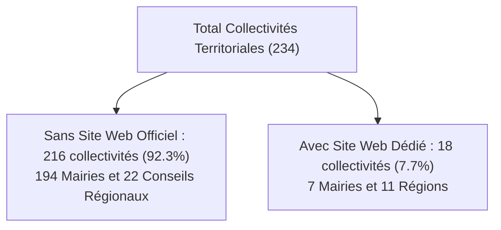
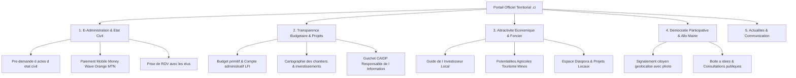
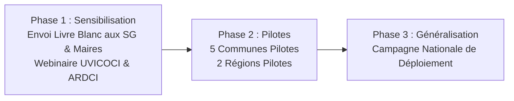

# 🏛️ DOSSIER STRATÉGIQUE & LIVRE BLANC
## Transformation Numérique des Collectivités Territoriales de Côte d'Ivoire
### *Programme de Déploiement de Portails Web Modernes & E-Services pour les 22 Conseils Régionaux et 194 Mairies sans site web officiel*

---

> **Auteur & Éditeur** : Programme CivicData CI / SuiviBudget Côte d'Ivoire  
> **Date de Publication** : Février 2026  
> **Cibles** : Maires, Présidents de Conseils Régionaux, Secrétaires Généraux, Directeurs des Systèmes d'Information, Partenaires au Développement (DGDDL, UVICOCI, ARDCI, CAIDP, Banque Mondiale, AFD, BAD).

---

## 1. Contexte & Diagnostic Territorial en Côte d'Ivoire (2026)

### 1.1. L'État des Lieux du Numérique Territorial
En 2026, la Côte d'Ivoire compte **289 institutions et collectivités territoriales** structurées en 5 pôles :
1. **Pouvoir Exécutif** : 35 Ministères & Primature $\rightarrow$ **100% équipés en sites `.gouv.ci`**.
2. **Institutions de la République** : 13 Institutions $\rightarrow$ **100% équipées en sites `.ci`**.
3. **Autorités & Régulateurs** : 7 Régulateurs $\rightarrow$ **100% équipés en sites `.ci`**.
4. **Conseils Régionaux & Districts** : 33 Entités $\rightarrow$ **22 Régions sans site web officiel (67%)**.
5. **Mairies & Communes** : 201 Communes $\rightarrow$ **194 Communes sans site web officiel (96,5%)**.

### 1.2. Le « Piège Facebook » : Une Dépendance Vulnérable
La quasi-totalité des 216 collectivités sans site web concentre 100% de sa communication sur une simple **page Facebook**. Si Facebook permet un contact direct avec les administrés, il présente des failles structurelles majeures pour une administration publique :
* **Aucune valeur légale ni archivage** : Les délibérations, budgets primitifs, arrêtés municipaux et comptes administratifs publiés dans un post disparaissent sous le flux d'actualité en 48 heures.
* **Non-conformité avec la Loi CAIDP n°2013-867** : La loi ivoirienne impose la mise à disposition proactive et permanente des documents publics. Une page Facebook ne remplit pas ces exigences de conservation et de recherche documentaire.
* **Absence d'E-Services** : Impossibilité de traiter des demandes d'actes d'état civil, d'encaisser des taxes municipales via Mobile Money ou de délivrer des certificats.
* **Dépendance algorithmique & Risque de sécurité** : Risque d'usurpation d'identité par de fausses pages, piratage de comptes administrateurs, ou suspension sans préavis par une multinationale privée.
* **Invisibilité sur les moteurs de recherche (Google)** : Les démarches et formulaires ne sont pas indexés par Google. La diaspora et les investisseurs internationaux ne trouvent aucune information structurée.

---

## 2. Benchmark International : Les Meilleures Pratiques Mondiales

Une analyse approfondie des portails municipaux et régionaux de référence mondiale révèle 5 modèles d'excellence directement adaptables au contexte ivoirien :

### 🇬🇧 1. Gov.uk & Ville de Bristol (Royaume-Uni) — *La Clarté Radicale & L'Orientation Action*
* **Principe clé** : L'usager ne vient pas lire de longs discours politiques, il vient accomplir une tâche en 2 clics.
* **Bonnes pratiques** :
  - Page d'accueil dominée par une barre de recherche universelle et 6 boutons d'actions prioritaires (*Demander un acte, Payer une taxe, Signaler un problème, Consulter les chantiers*).
  - Typographie contrastée, zéro jargon administratif, accessibilité mobile à 100%.

### 🇫🇷 2. Villes de Lyon & Paris (France) — *La Transparence & Le Budget Participatif*
* **Principe clé** : Rendre des comptes aux citoyens et co-construire la ville.
* **Bonnes pratiques** :
  - Carte interactive des chantiers en temps réel avec date de livraison et coût.
  - Espace de téléchargement des délibérations du conseil municipal en PDF avec moteur de recherche par date et thème.
  - Plateforme de vote citoyen pour les budgets participatifs de quartier.

### 🇸🇬 3. GovTech Singapour (LifeSG) — *Les Services par Moments de Vie*
* **Principe clé** : L'administration s'organise autour de la vie du citoyen, pas selon ses organigrammes internes.
* **Bonnes pratiques** :
  - Parcours thématiques : *« Je déclare une naissance »*, *« Je crée un commerce dans ma commune »*, *« Je construis ma maison (Permis) »*, *« Je demande une aide sociale »*.

### 🇷🇼 4. Ville de Kigali & Irembo (Rwanda) — *Le Tout-Mobile Money & Le Zéro Papier*
* **Principe clé** : Adaptation totale aux réalités africaines (smartphone first, faible bande passante, mobile money).
* **Bonnes pratiques** :
  - Paiement intégré des taxes et redevances municipales par Mobile Money (Wave, Orange, MTN, Moov).
  - Génération d'actes d'état civil avec QR Code de vérification cryptographique immédiate.
  - Site ultra-léger (< 500 Ko) fonctionnant parfaitement sur réseau 3G rural.

### 🇺🇸 5. New York City (NYC.gov / 311) — *Le Signalement Citoyen Géolocalisé*
* **Principe clé** : Chaque citoyen devient un capteur d'amélioration de sa commune.
* **Bonnes pratiques** :
  - Module « Allo Mairie » : prise de photo d'un nid-de-poule, caniveau bouché ou panne d'éclairage avec géolocalisation GPS.
  - Ticket de suivi citoyen permettant de voir l'intervention des services municipaux.

---

## 3. Architecture Blueprint : Le MVP « Portail Territorial Civic CI »

Pour répondre aux besoins des 216 collectivités ivoiriennes, nous avons modélisé une architecture standardisée, modulaire et adaptée aux réalités locales :

---

## 4. Spécifications Détaillées des 5 Modules du MVP

### 📋 Module 1 : E-Administration & Guichet d'État Civil
* **Pré-demande d'actes** : Formulaire simple (extrait de naissance, certificat de résidence, légalisation).
* **Paiement intégré Mobile Money** : Règlement sécurisé des timbres municipaux et taxes d'occupation du domaine public (ODP) via Wave, Orange Money, MTN MoMo, Moov Money.
* **Notification SMS / WhatsApp** : Alerte de l'usager dès que son document est signé et disponible au guichet de la mairie.

### 💰 Module 2 : Transparence Budgétaire & Suivi des Chantiers (Synergie CivicData CI)
* **Tableau de bord financier** : Infographie claire sur les dotations d'investissement et de fonctionnement.
* **Fiches Chantiers** : Titre, montant alloué, quartier/village, statut (*En cours, Livré*), photos d'avancement.
* **Conformité CAIDP** : Page officielle désignant le Responsable de l'Information (RI) avec formulaire direct de demande de document selon la loi n°2013-867.

### 💼 Module 3 : Attractivité Économique, Diaspora & Foncier
* **Fiche d'identité territoriale** : Superficie, population, découpage en sous-préfectures/villages, atouts économiques.
* **Guide de l'Investisseur** : Opportunités de transformation agro-industrielle (cacao, anacarde, hévéa, vivrier), zones industrielles locales, fiscalité communale.
* **Espace Diaspora** : Projets de co-développement, opportunités d'investissements immobiliers et mécénat pour les écoles et dispensaires.

### 📢 Module 4 : Démocratie Participative & « Allo Mairie / Allo Région »
* **Signalement terrain** : Formulaire citoyen avec photo et géolocalisation pour signaler un dysfonctionnement urbain (voirie, éclairage, salubrité).
* **Tableau de bord interne pour les services techniques municipaux** : Suivi des interventions et notification de résolution aux citoyens.

### 📰 Module 5 : Actualités, Délibérations & Identité Républicaine
* **Arrêtés et Délibérations** : Espace de téléchargement officiel des actes administratifs signés par le Maire ou le Président.
* **Galerie et Profils des Élus** : Photo officielle, biographie républicaine, attributions des adjoints au maire et conseillers.
* **Intégration Réseaux Sociaux** : Flux automatique synchronisé avec la page Facebook et le compte X pour démultiplier la portée.

---

## 5. Matrice d'Adaptation par Typologie de Collectivité

| Typologie de Collectivité | Exemples Cibles | Modules Clés Prioritaires | Enjeux Majeurs |
| :--- | :--- | :--- | :--- |
| **Grandes Communes Urbaines** | *Adjamé, Koumassi, Marcory, Plateau, Port-Bouët, Daloa, San Pedro* | E-Services État Civil, Recouvrement ODP/Taxes, Allo Mairie, Urbanisme. | Fluidifier les files d'attente, maximiser les recettes fiscales propres, gérer la salubrité. |
| **Communes Agro-Pastorales de l'Intérieur** | *Sinématiali, Ferkessédougou, Divo, Aboisso, Séguéla, Man* | Cartographie des Pistes Rurales, Marchés de Collecte, Hydraulique/Forages, CAIDP. | Rendre visibles les chantiers dans les villages rattachés, attirer les coopératives et négociants. |
| **Conseils Régionaux (31 Régions)** | *Gbêkê, Poro, Haut-Sassandra, Tonkpi, Gôh, Cavally, Kabadougou* | Plan de Développement Régional (PDR), CHR/Santé, Lycées, Attractivité Bailleurs (Banque Mondiale, AFD). | Mobiliser les financements internationaux, valoriser le désenclavement et la coopération décentralisée. |

---

## 6. Modèle Économique & Offre Commerciale de Déploiement

### Pack 1 : « Présence Institutionnelle & Transparence CAIDP » (Idéal Mairies Rurales)
* Site web responsive clé en main en `.ci` sécurisé SSL (HTTPS).
* Modules : Présentation du Conseil, Budgets & Chantiers CivicData CI, Délibérations PDF, Guichet CAIDP.
* Hébergement souverain, nom de domaine et maintenance 1 an.
* **Délai de déploiement** : 10 jours ouvrés.

### Pack 2 : « Mairie Connectée & E-Services » (Idéal Grandes Communes & Villes Moyennes)
* Tous les éléments du Pack 1.
* Module E-Administration d'État Civil avec paiement Mobile Money (Wave, Orange, MTN).
* Module « Allo Mairie » de signalement citoyen géolocalisé.
* Formation des agents municipaux (2 journées sur site ou en visio).
* **Délai de déploiement** : 20 jours ouvrés.

### Pack 3 : « Hub Territorial Métropole & Conseil Régional » (Idéal Régions & Districts)
* Tous les éléments du Pack 2.
* Portail d'Attractivité Économique & Guide des Bailleurs de Fonds multilingue (Français / Anglais).
* Espace Diaspora & Cartographie interactive SIG des investissements structurants régionaux.
* Support dédié et accompagnement stratégique de communication institutionnelle.
* **Délai de déploiement** : 30 jours ouvrés.

---

## 7. Plan d'Action & Stratégie de Prospection

### Argumentaire Décisif lors de la Prise de Contact avec les Élus :
1. *« Monsieur le Maire / Monsieur le Président, votre page Facebook est un excellent canal d'actualité, mais vos administrés et la diaspora ont besoin d'un portail officiel pour faire leurs démarches et voir vos réalisations concrètes sur Google. »*
2. *« La Loi CAIDP impose la publication de vos budgets. Notre solution intègre déjà toutes les données officielles vérifiées de votre collectivité pour vous mettre en conformité immédiate. »*
3. *« Vos recettes municipales augmenteront grâce au paiement en ligne sécurisé des taxes par Mobile Money sans déperdition de fonds. »*

---

## 8. Annexe : Synthèse des 216 Collectivités Cibles Prioritaires

* **22 Conseils Régionaux à équiper** : *Béré, Bounkani, Cavally, Folon, Gbêkê, Gbôklè, Gôh, Gontougo, Guémon, Hambol, Haut-Sassandra, Kabadougou, Lôh-Djiboua, Moronou, N'Zi, Poro, Sud-Comoé, Tchologo, Tonkpi, Worodougou, Béré Nord, Bélier*.
* **194 Mairies à équiper** : Liste intégrale téléchargeable en format CSV depuis le Dashboard Administrateur.

---
*Document certifié par l'équipe d'Architecture & Développement CivicData CI — Prêt pour exploitation commerciale et institutionnelle.*
